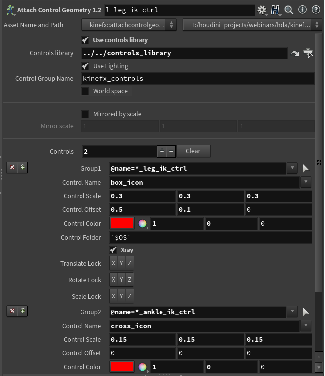
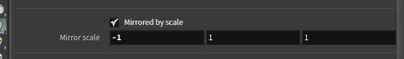
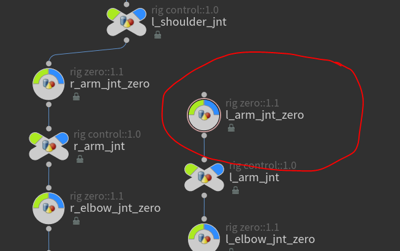
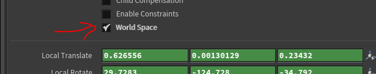

# kinefx tools
Houdini kinefx용 리깅 툴 및 유틸 모음집.

## Support
제 작업물이 유용하다고 생각하신다면 가상의 커피를 사서 저를 도와주셨으면 합니다.
[](https://ko-fi.com/P5P337EBN)

## 설치 방법
### Python 스크립트
복사: **create_obj_ctrls.py** to source python directory.
[Houdini DOCs - Python scripts location](https://www.sidefx.com/docs/houdini/hom/locations.html)
혹은 *sys.path*에 추가하세요

### 디지털 에셋
스크립트를 사용하기 전에 모든 디지털 에셋이 설치되어 있고 사용할 준비가 되었는지 확인하세요.

## HDAs
몇 가지 유용한 HDA가 있으며, 스크립트와 함께 사용하려면 몇 가지를 설치해야 합니다.

### Controls 라이브러리 (controls_library::1.0) (OBJ)
**Attach Control Geometry SOP**와 함께 사용할 수 있는 다양한 모양의 컨트롤을 형상으로 생성합니다.

다음이 필요로 함: **create_obj_ctrls.py**

---

* ### Attach Control Geometry (kinefx::attach_geometry_control::1.2) (SOP)
   부착 제어 지오메트리가 수정되었습니다. 컨트롤을 만드는 프로세스를 "캡슐화"하기 위해 추가 기능을 추가했습니다.
   이 한 노드에서 직접 컨트롤에 대한 개별 색상을 할당하고 컨트롤의 배율 및 오프셋을 조작할 수 있습니다.  
   

   이제 컨트롤의 "라이브러리"를 입력으로 연결하는 대신 노드 경로를 사용할 수 있습니다:
   

   이러한 특정 컨트롤에 대한 골격이 스케일로 미러링된 경우 **스케일로 미러링됨**-> **ON**을 설정하고 미러링된 축 컨트롤을 지정해야 합니다.
   예를 들어, X축을 따라 컨트롤이 미러링된 경우, 미러 스케일을 {-1.0, 1.0, 1.0}으로 설정해야 합니다.  
   

   You can specify which channels will be locked after creating controls by setting **Translate/Rotate/Scale Lock** parameter
   **Translate/Rotate/Scale Lock** 파라미터를 설정하여 컨트롤을 생성한 후 잠글 채널을 지정할 수 있습니다.

   **Control Folder** 올바른 HDA에서 컨트롤을 승격할 폴더의 이름을 지정할 수 있습니다. HDA로 제어를 승격하는 두 번째 단계이므로 해당 매개 변수를 채우는 것은 선택 사항입니다.

   Also, this node creates extra attributes that are quired during the creation of *object level* controls. Check step by step tutorial. Setting **Xray** parameter **ON** will make *object level* controls automatically set to Xray.
   또한, 이 노드는 *object level* 컨트롤을 만드는 동안 필요한 추가 속성을 만듭니다. 단계별 자습서를 확인합니다.
   **Xray** 파라미터를 **ON**으로 설정하면 *object level* 컨트롤이 자동으로 Xray로 설정됩니다.

   다음이 필요로 함: **create_obj_ctrls.py**

---

* ### rig control 1.0 (rig_control::1.0) (OBJ)
   rig control로 직접 사용되는 노드입니다. 제어 라이브러리에서 로드되는 제어 셰이프의 동적 변경을 허용합니다. *Thickness* 파라미터는 두께 조절의 표시 방법을 쉽게 제어합니다. 
   

   This node will be should be used in conjunction with *rig_zero* node as its parent (zero group). 

   required by: **create_obj_ctrls.py**

---

* ### rig zero 1.1 (rig_zero::1.1) (OBJ)
   This acts as a zero group for controls. But also moves them to keep them in sync with the joint's position. That node reads detail attributes generated by *create_zero_attr::1.2*

   

   All of that is created and connected automatically when using the create_obj_ctrls.py script.

   World space checkbox defines if the position of **rig zero node** should be queried from *local* or *world* transformation. It's handled automatically so you don't need to worry about it but in case if you unparent control which previously had a parent remember to turn **ON** world space

   

   

   required by: **create_obj_ctrls.py**

---

* ### create zero attrs 1.1 (create_zero_attr::1.1) (SOP)
   Breaks down *localtransform* matrix per channel and saves it as detail attribute for every joint. That information later is used by *rig_zero* node to move it.
   From version 1.2 it also breaks down world transformation and outputs for *rig_zero* node

   required by: **create_obj_ctrls.py**

---

* ### joint apply offset (joint_apply_offset::1.0) (SOP)
   Applies offset to joints. Useful for example when you do spline IK, after solving IK you would like to keep joints offset in such a way that they will match the original skeleton in the default pose. 

   To see it in action open: start.hiplc

   
----

* ### Space switch (space_switch::1.0) (SOP)
   The space switch node allows you to change spaces for the specified joint. To the **first input** connect joint/control (those are the same things) for which space switch you want to perform. **Second input** get all parent's information, those transforms will represent your different spaces.

   You can specify as many spaces as you want by adding entries with + sing next to the *Config* parameter

   
 
   In the **Joint** type the joint name with *@name=* at front of it. Space switch will happen for this joint. Use the multi-instance parameter *Config* to chose how many space switches you would like to have.

   **Space name**: it's a descriptive name of your space switch. That name will show up on the menu where you can choose your spaces
   **Parent**: Joint name (with *@name=*) of that particular space/transform/parent.

   **Space** Allow you to chose currently active space:
   

   **Components** Let you specify for which transformation components you want to perform space switch. For example, for head FK control you only have a rotation space switch.

   **Tip**: In case if you would like to have a separated *Translation* and *Rotation* space switch. You can stack those two nodes, one after another.
   
   **Tutorial**: Check out this handy tutorial about how to use it:
   
[](https://www.youtube.com/watch?v=2TvOR7ohPdo)
----

## Usage

### Create object level control
```python
# You can add this code as button on shelf 
from kinefx_extra import create_obj_ctrls
create_obj_ctrls.run()
```

### Promote selected controls:
After the creating controls with above script. Now at object level you will have a group called controls. 


That will let you easily select all controls for your rig. Then just run script:
```python
# You can add this code as button on shelf 
import kinefx_tools
kinefx_tools.create_obj_ctrls.promote_selected_controls()
```

### Create object level controls - Video:
[](https://www.youtube.com/watch?v=uQ1cNjDZ-fs)

### Easy way of locking channels- Video:
[](https://www.youtube.com/watch?v=iCS5VFZQDQU)

### Create object level controls - Video:
[](https://www.youtube.com/watch?v=8Ev4VLDgE5I)

### How to use Space Switch node - Video:
[](https://www.youtube.com/watch?v=2TvOR7ohPdo)

## Tips

### Bypass Attach Controls Geometry node
After creating your object level controls, you can bypass all Attach Controls Geometry nodes. That will speedup rig significantly due to the slow Python SOP inside. They aren't needed anymore, but keep them in case you would like to change something later. The bypass is enough. You can create group: or bundle if you prefer to be able to easily switch them ON and OFF. 

### Use blast instead of delete joints SOP
Delete joints sop does an extra reparenting steps via python code. Use blast wherever you can. 


## Contributing and support
Pull requests are welcome. For major changes, please open an issue first to discuss what you would like to change.

## License
[Apache-2.0](https://choosealicense.com/licenses/apache-2.0/)
